# Admin Flows

**Implements:** baseline §10 admin journeys, §4 permission model · `docs/04` §6, §7.4, §7.6, §7.7 · `docs/05` T-products, T-product_ownerships, T-approval_requests, T-payments, T-orders, T-invoices, T-leads, T-queries, T-payouts, T-expenses, T-dashboard_layouts
**Decision IDs:** D-1102, D-1104, D-1105, D-1107, D-1101, D-120, D-508, D-509, D-516, D-511, D-514, D-703, D-704, D-705, D-706, D-702, D-1106, A-302, A-1101, BR-05, BR-06, BR-12, BR-13, BR-16, BR-17

Every admin mutation runs as a Server Action: Zod parse → `authz.assert` → `service` in one transaction → `audit_logs` row → `revalidateTag` (`docs/04` §6). That chain is implied in every diagram below and drawn only once (§1).

---

## 1. Product creation → offerings → ownership proposal → dual approval → schedule/publish (A-302, D-1102, BR-05, BR-12)

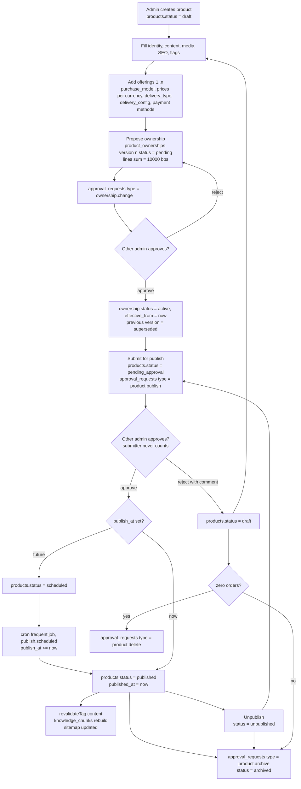

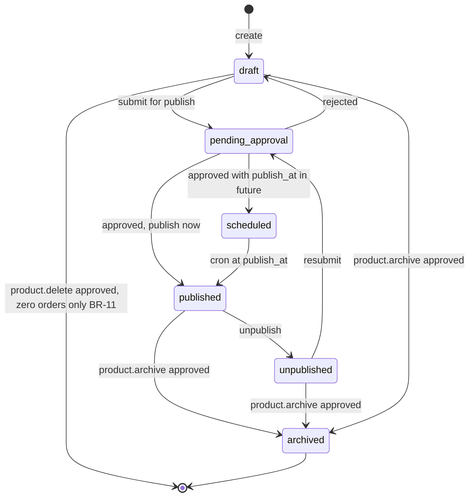

**Legend:** an ownership must be `active` before publish so that every paid order item can snapshot an `ownership_id` (BR-05). Deletion is possible only with zero orders; otherwise archive (BR-11).

---

## 2. Payment confirmation with shortfall (D-516, D-411, BR-06)

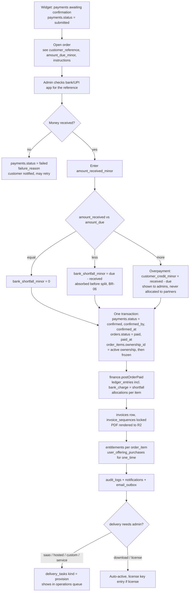

---

## 3. Manual project order and invoice (D-1107, D-510, A-502, BR-16)

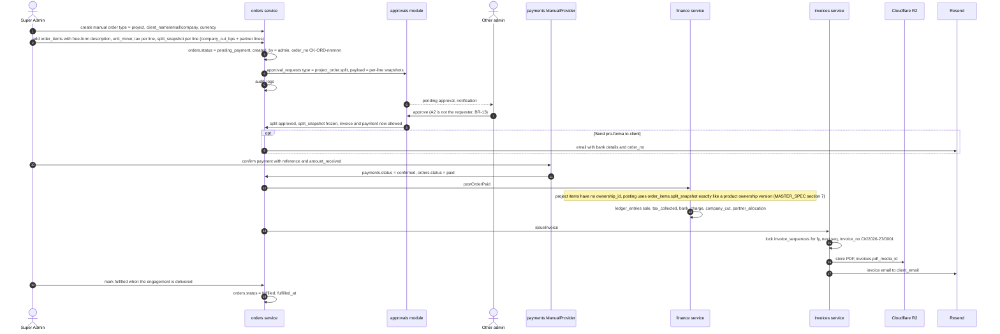

**Legend:** project revenue flows through the same order and ledger model as product sales (A-502). Each project line carries a `split_snapshot`; the order cannot be invoiced or paid until the `project_order.split` request is approved by the other admin(s) (MASTER_SPEC §7 "Project order splits", BR-05). Offline product sales use the same path with `type = product`, real offerings and no split approval.

---

## 4. Lead pipeline state machine (D-703, D-704, D-705, D-706)

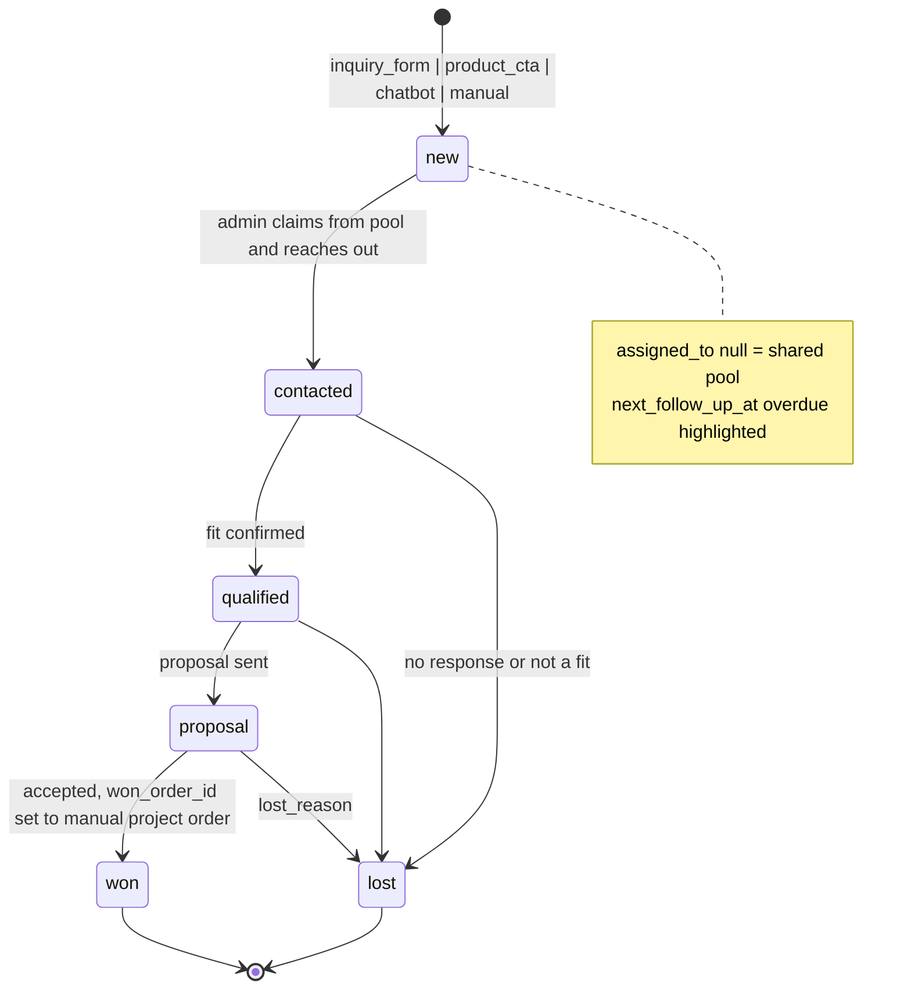

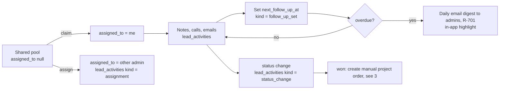

---

## 5. Query handling (D-702, D-1002)

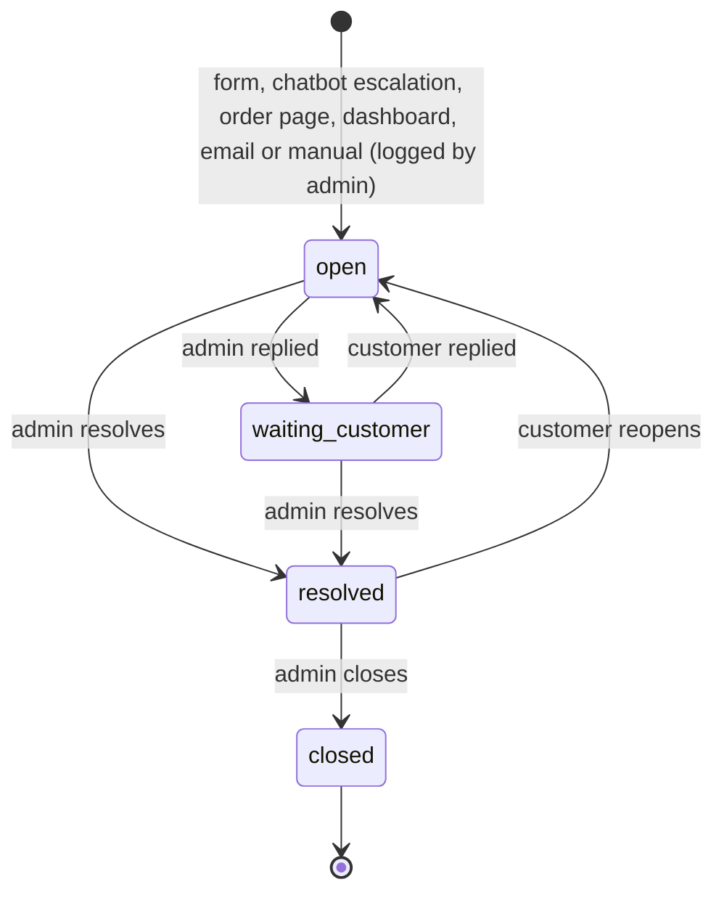

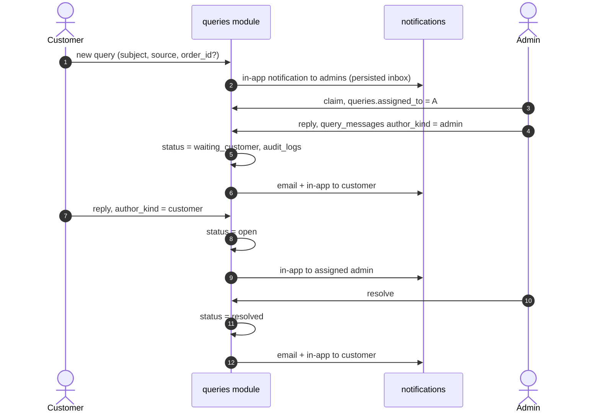

---

## 6. Generic approval request sequence (A-1101, BR-13, MASTER_SPEC §4.5)

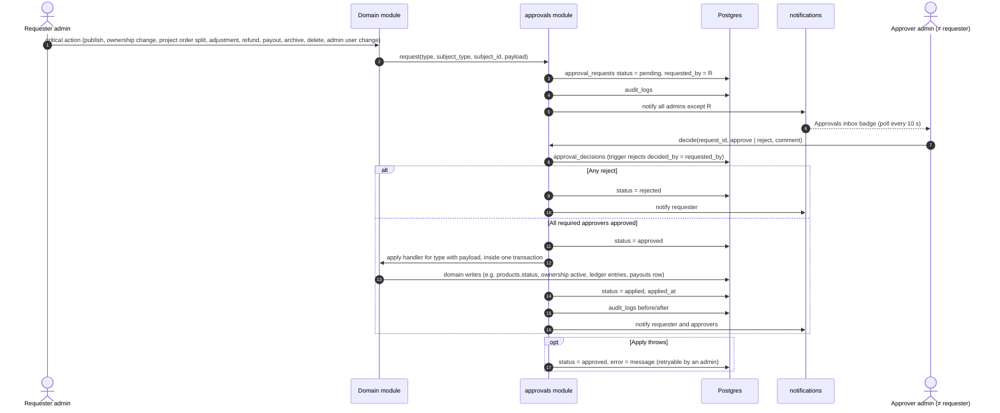

**Legend:** with two founders "all admins except the requester" means the other founder. Requests never expire; the system widget shows pending age (`docs/04` §13).

---

## 7. Payout recording (D-511, D-1105, BR-13)

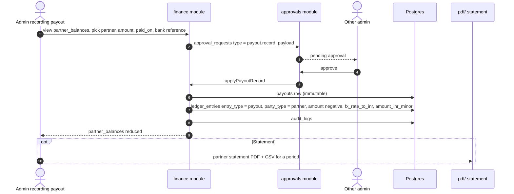

---

## 8. Expense entry (D-514)

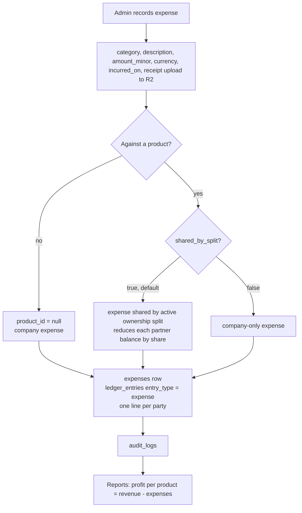

**Legend:** expenses do not require dual approval (BR-13 list); corrections are adjusting entries via `ledger.adjustment` (BR-17).

---

## 9. Content publish and revalidation (D-1106, ADR-10, `docs/04` §7.7)

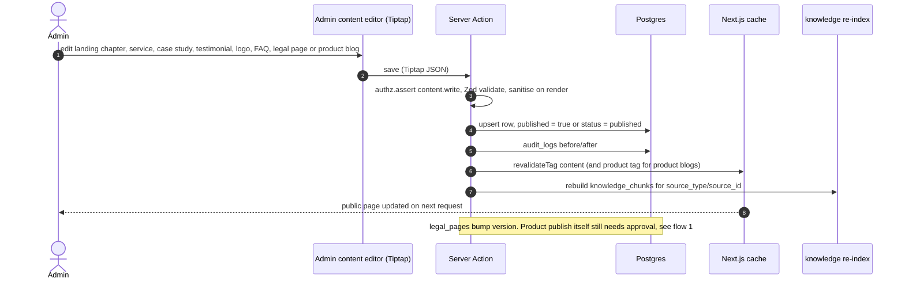

---

## 10. Widget dashboard layout save (D-120, D-1101, `docs/04` §7.6)

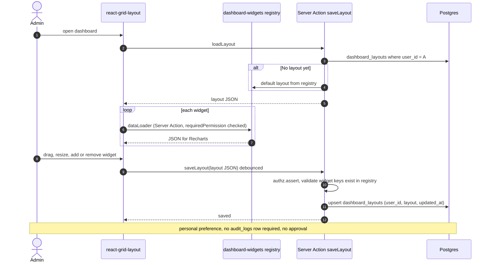
