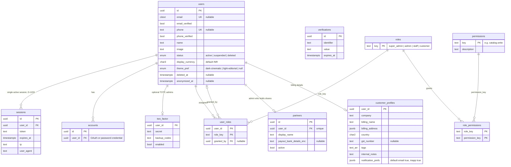
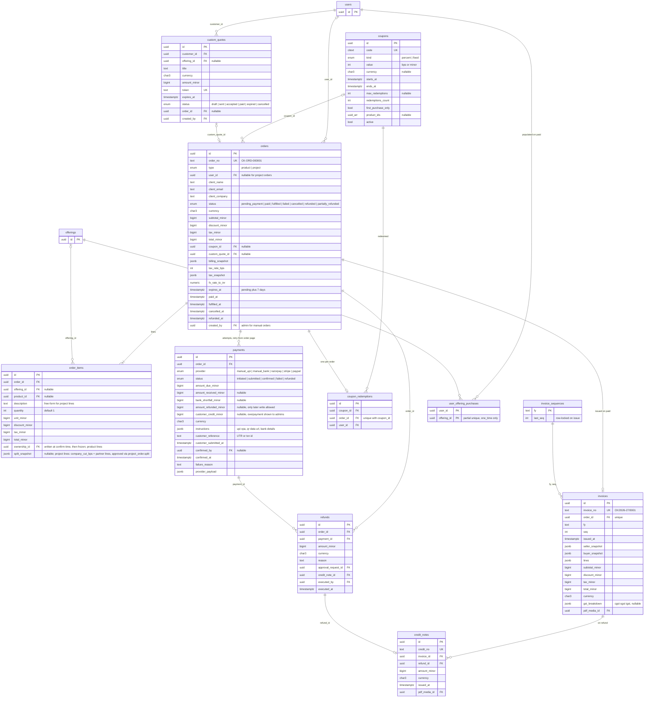
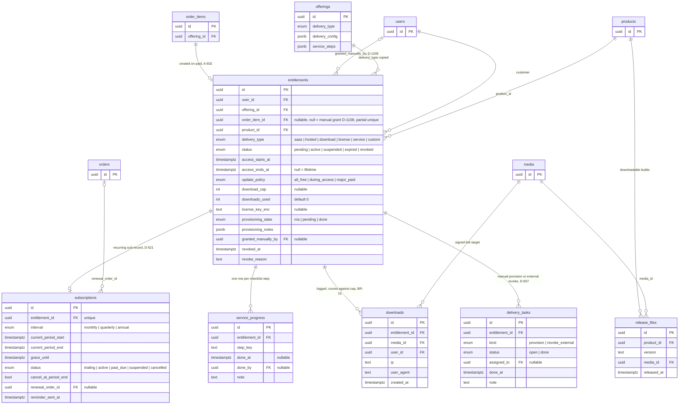
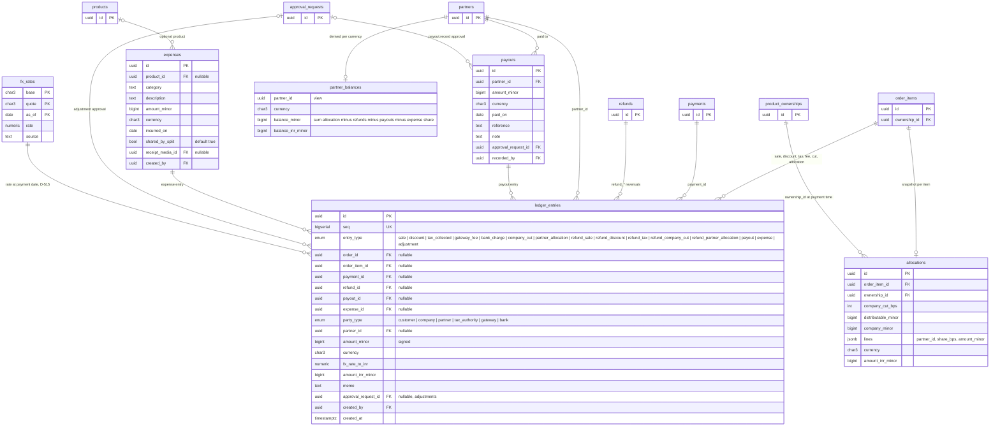
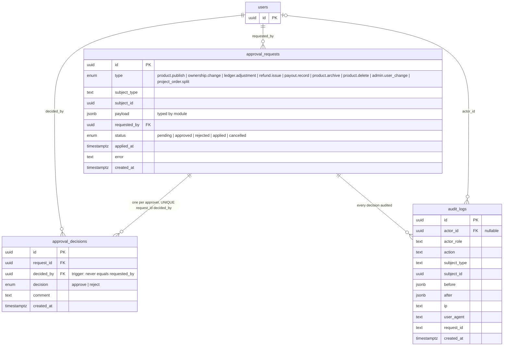
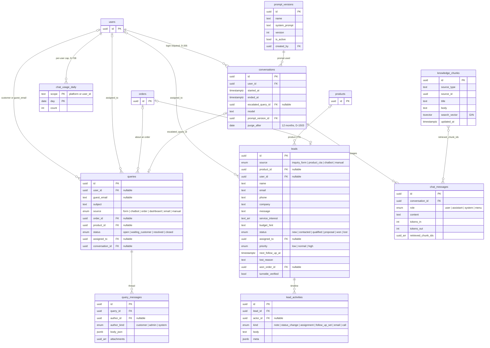
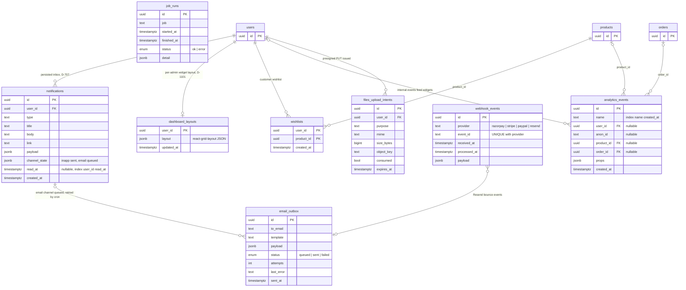

# Database ER Diagrams

**Implements:** `docs/05-DATABASE-DESIGN.md` §1–§12 (table IDs `T-<name>`) · `MASTER_SPEC.md` §4.1, §4.2, §4.3, §4.8 · baseline §5–§8
**Decision IDs:** A-201, A-301, A-302, A-602, A-1101, BR-05, BR-06, BR-07, BR-10, BR-13, BR-15, BR-16, BR-17, BR-18, D-303, D-502, D-508, D-509, D-515, D-516, D-517, D-521, D-606, D-607, D-608, D-1104, D-1203, D-1503

Conventions in every diagram: `id uuid` primary keys, money as `bigint` minor units plus `currency char3`, enums shown as `enum` with their values in the comment, `PK`/`FK`/`UK` markers as in `docs/05`. Composite primary keys are shown by marking each member column `PK`. Only key columns and the columns that drive behaviour are drawn; `created_at`/`updated_at` are omitted unless they matter. Types with parentheses in Postgres (`char(3)`, `numeric(18,8)`) are written `char3`, `numeric` for Mermaid.

---

## 1. Identity and access (T-users, T-roles, T-user_roles, T-partners, T-customer_profiles)

**Legend:** one identity table; roles are assignments, not account types (A-201). `sessions`, `accounts`, `verifications`, `two_factor` are owned by Better Auth (ADR-03). A partner is always an admin user (D-512).

---

## 2. Catalog, offerings and ownership (T-categories, T-products, T-product_*, T-media, T-offerings, T-offering_prices, T-offering_payment_methods, T-product_ownerships, T-product_ownership_lines)

```mermaid
erDiagram
    categories {
        uuid id PK
        uuid parent_id FK "nullable, depth max 2 by trigger"
        text name
        text slug UK
        int position
    }
    tags {
        uuid id PK
        text name UK
        text slug UK
    }
    product_tags {
        uuid product_id PK
        uuid tag_id PK
    }
    products {
        uuid id PK
        text name
        text slug UK
        text short_description
        jsonb description_json "Tiptap"
        uuid category_id FK "nullable"
        enum status "draft | pending_approval | scheduled | published | unpublished | archived"
        timestamptz publish_at "nullable"
        timestamptz published_at
        timestamptz archived_at
        bool is_featured
        bool is_unlisted
        bool is_coming_soon
        bool is_refundable "default false"
        bool tax_enabled "default false"
        text current_version
        jsonb features
        jsonb benefits
        text_arr industry
        text_arr tech_stack
        text live_demo_url
        uuid og_image_media_id FK
        text canonical_url
        tsvector search_vector "generated, GIN"
        uuid created_by FK
        uuid updated_by FK
    }
    product_versions {
        uuid id PK
        uuid product_id FK
        text version
        jsonb changelog_json
        timestamptz released_at
    }
    product_faqs {
        uuid id PK
        uuid product_id FK
        text question
        jsonb answer_json
        int position
    }
    product_testimonials {
        uuid id PK
        uuid product_id FK
        text author_name
        text quote
        uuid avatar_media_id FK
        bool published
    }
    product_media {
        uuid id PK
        uuid product_id FK
        enum kind "image | screenshot | gallery | video_embed | video_file | presentation | attachment | og"
        uuid media_id FK "nullable"
        text embed_url "nullable"
        text title
        text alt "mandatory for image kinds, WCAG"
        int position
    }
    media {
        uuid id PK
        text bucket
        text object_key UK
        text mime
        bigint size_bytes
        int width
        int height
        int duration_s
        text checksum
        text blur_hash "nullable, LQIP placeholder"
        enum visibility "public | private"
        uuid uploaded_by FK
    }
    slug_redirects {
        uuid id PK
        enum entity "product | case_study | blog"
        text old_slug "UNIQUE with entity"
        text new_slug
    }
    product_blogs {
        uuid id PK
        uuid product_id FK "unique"
        text slug UK
        text title
        jsonb body_json
        uuid cover_media_id FK
        enum status "draft | published"
        timestamptz published_at
        uuid author_id FK
    }
    release_files {
        uuid id PK
        uuid product_id FK
        text version
        uuid media_id FK
        timestamptz released_at
    }
    featured_products {
        uuid product_id PK
        int position
    }
    offerings {
        uuid id PK
        uuid product_id FK
        text name
        text slug "unique per product"
        bool is_default
        enum purchase_model "one_time | subscription | custom_quote"
        enum billing_interval "monthly | quarterly | annual | null"
        int trial_days "nullable"
        text license_type "nullable"
        enum delivery_type "saas | hosted | download | license | service | custom"
        jsonb delivery_config "provisioning, download_cap, access_months, update_policy"
        jsonb service_steps "nullable, D-608"
        jsonb instructions_json "nullable, A-601"
        enum status "active | inactive"
    }
    offering_prices {
        uuid offering_id PK
        char3 currency PK
        bigint amount_minor
        bigint compare_at_minor "nullable, strike-through"
    }
    offering_payment_methods {
        uuid offering_id PK
        enum method PK "manual_upi | manual_bank | razorpay | stripe | paypal"
    }
    product_ownerships {
        uuid id PK
        uuid product_id FK
        int version "unique per product"
        int company_cut_bps "default 0"
        enum status "pending | active | superseded"
        timestamptz effective_from "nullable"
        uuid approval_request_id FK "nullable"
        uuid created_by FK
    }
    product_ownership_lines {
        uuid ownership_id PK
        uuid partner_id PK
        int share_bps "sum = 10000 per ownership"
    }
    partners {
        uuid id PK
        uuid user_id FK
    }

    categories o|--o{ categories : "parent_id"
    categories o|--o{ products : "category_id"
    products ||--o{ product_tags : "tagged"
    tags ||--o{ product_tags : "tag_id"
    products ||--o{ product_versions : "public changelog"
    products ||--o{ product_faqs : "faqs"
    products ||--o{ product_testimonials : "curated"
    products ||--o{ product_media : "media"
    media o|--o{ product_media : "stored file"
    media o|--o{ products : "og_image_media_id"
    products ||--o| product_blogs : "one blog"
    products ||--o{ release_files : "builds per version"
    media ||--o{ release_files : "media_id"
    products ||--o| featured_products : "landing feature"
    products ||--|{ offerings : "1..n purchasable plans, A-301"
    offerings ||--|{ offering_prices : "base currency row mandatory"
    offerings ||--o{ offering_payment_methods : "enabled methods"
    products ||--o{ product_ownerships : "effective-dated versions"
    product_ownerships ||--|{ product_ownership_lines : "partner split"
    partners ||--o{ product_ownership_lines : "partner_id"
```

**Legend:** prices, purchase models and delivery live on offerings, never on products (MASTER_SPEC §4.2). `slug_redirects` keeps old slugs of published products, case studies and blogs for 301s (MASTER_SPEC §7 "Slug changes"); `product_media.alt` and `media.blur_hash` feed accessible, CLS-free image delivery (docs/08 §12). Exactly one `product_ownerships` row per product is `active` (partial unique index); lines must sum to 10000 bps (BR-06, BR-07); a new version becomes active only via an `approval_requests` row of type `ownership.change` (BR-05).

---

## 3. Commerce (T-orders, T-order_items, T-payments, T-coupons, T-custom_quotes, T-invoices, T-credit_notes, T-refunds)

**Legend:** immutable after the fact: `invoices`, `credit_notes`, and `payments` once `status = confirmed` except the single transition `confirmed → refunded` plus `amount_refunded_minor` (trigger; MASTER_SPEC §4.1, §7). Orders carry both `user_id` (customers) and `client_*` (project orders created by admins, D-1107). `order_items.ownership_id` freezes which split version applies for product lines (BR-05); project lines carry `split_snapshot`, dual-approved as `project_order.split` before invoice or payment (MASTER_SPEC §7). `payments.customer_credit_minor` records an overpayment for admins; it is never allocated. Unpaid orders expire at `expires_at` (BR-10).

---

## 4. Entitlements, delivery and subscriptions (T-entitlements, T-subscriptions, T-service_progress, T-downloads, T-delivery_tasks, T-release_files)

**Legend:** the entitlement is the delivery pivot (MASTER_SPEC §4.3): one per paid `order_item`, or `order_item_id = null` for an admin manual grant (D-1108); its `delivery_type` selects the handler. Subscriptions are manual-renew in release 1 (BR-14). `service_progress` rows are seeded from `offerings.service_steps` (D-608).

---

## 5. Finance ledger, append-only (T-ledger_entries, T-allocations, T-payouts, T-expenses, T-fx_rates, VIEW partner_balances)

**Legend:** `ledger_entries`, `allocations`, `payouts` reject UPDATE/DELETE by trigger (BR-17). Every entry stores the transaction currency amount plus the INR equivalent at the payment-date rate (D-515). `partner_balances` is a plain SQL view over entries, never a stored or materialised balance (ADR-05, `docs/04` §7.2).

---

## 6. Approvals and audit (T-approval_requests, T-approval_decisions, T-audit_logs)

**Legend:** one generic approval mechanism for all dual-approval actions (A-1101, MASTER_SPEC §4.5). `audit_logs` is append-only; every admin mutation writes one row in the same transaction (D-1104). Subject tables referenced by `subject_type`/`subject_id`: products, product_ownerships, orders (project_order.split), ledger_entries, refunds, payouts, users.

---

## 7. Leads, queries and chat (T-leads, T-queries, T-conversations, T-chat_messages)

**Legend:** lead pipeline statuses per D-703; queries are support threads (never "tickets"); conversations are chatbot sessions (never "queries"). `knowledge_chunks` is rebuilt by cron and on content publish from products, offerings, services, FAQs, legal pages and case studies (`docs/04` §9).

---

## 8. Content (CMS-lite, `docs/05` §10)

```mermaid
erDiagram
    landing_chapters {
        uuid id PK
        text key UK "who | build | sell | proof | talk"
        text title
        text subtitle
        jsonb body_json
        jsonb media
        jsonb cta
        int position
        bool published
    }
    services {
        uuid id PK
        text slug UK
        text title
        text summary
        jsonb deliverables
        jsonb body_json
        text icon
        int position
        bool published
    }
    case_studies {
        uuid id PK
        text slug UK
        text title
        text client_name
        text industry
        jsonb problem_json
        jsonb solution_json
        jsonb results_json
        text_arr tech_stack
        uuid cover_media_id FK
        jsonb gallery
        bool published
        timestamptz published_at
        text seo_title
        text seo_description
    }
    testimonials {
        uuid id PK
        text quote
        text author_name
        text author_title
        text company
        uuid avatar_media_id FK
        enum context "site | product"
        uuid product_id FK "nullable"
        int position
        bool published
    }
    client_logos {
        uuid id PK
        text name
        uuid media_id FK
        text url
        int position
        bool published
    }
    faqs {
        uuid id PK
        text question
        jsonb answer_json
        enum scope "site | chatbot | product"
        uuid product_id FK "nullable"
        int position
        bool published
    }
    legal_pages {
        uuid id PK
        text key UK "privacy | terms | refunds | license"
        text title
        jsonb body_json
        int version
        timestamptz published_at
    }
    site_settings {
        text key PK "base_currency, tax_rate_bps, gstin, upi_vpa, bank_details, default_theme, ai_model, caps, flags, retention"
        jsonb value
        uuid updated_by FK
        timestamptz updated_at
    }
    product_blogs {
        uuid id PK
        uuid product_id FK "unique"
        text slug UK
        enum status "draft | published"
    }
    featured_products {
        uuid product_id PK
        int position
    }
    media {
        uuid id PK
    }
    products {
        uuid id PK
    }
    users {
        uuid id PK
    }

    media o|--o{ case_studies : "cover_media_id"
    media o|--o{ testimonials : "avatar_media_id"
    media ||--o{ client_logos : "media_id"
    products o|--o{ testimonials : "product context"
    products o|--o{ faqs : "product scope"
    products ||--o| product_blogs : "one blog per product, D-121"
    products ||--o| featured_products : "featured on landing"
    users o|--o{ site_settings : "updated_by"
```

**Legend:** all rich text is Tiptap JSON rendered server-side (ADR-10). Publishing any content row triggers `revalidateTag('content')` and a `knowledge_chunks` rebuild. `legal_pages` are versioned; `site_settings` holds feature flags read by `lib/feature-flags.ts` (MASTER_SPEC §4.11).

---

## 9. Notifications, dashboard, analytics and ops (`docs/05` §11)

**Legend:** notifications are written inside domain transactions and polled by the admin shell every 10 s (ADR-06). `job_runs` feeds the admin system widget with missed cron runs (`docs/04` §10). `email_outbox` is the Resend retry queue. `webhook_events` gives V1.1 gateway and Resend webhooks idempotency via `UNIQUE(provider, event_id)`.

---

## 10. Integrity rules cheat-sheet (`docs/05` §12)

| Rule | Tables | Mechanism |
|------|--------|-----------|
| Append-only | ledger_entries, allocations, payouts, invoices, credit_notes, audit_logs | `BEFORE UPDATE OR DELETE` trigger |
| Confirmed payments frozen | payments | Trigger allows only `status: confirmed → refunded` and `amount_refunded_minor` |
| Ownership lines sum to 10000 bps | product_ownership_lines | Deferred constraint trigger |
| One active ownership per product | product_ownerships | Partial unique index `WHERE status='active'` |
| Category depth ≤ 2 | categories | Trigger on `parent_id` |
| Approver ≠ requester | approval_decisions | Trigger `decided_by <> requested_by` |
| Gapless invoice numbering per FY | invoice_sequences | `SELECT … FOR UPDATE` in issuing transaction |
| One-time offering bought once | user_offering_purchases | Partial unique index |
| Retention purge | chat_messages, conversations, users | Cron: purge after `purge_after`; users are anonymised immediately on self-delete (BR-18, MASTER_SPEC §7) |
