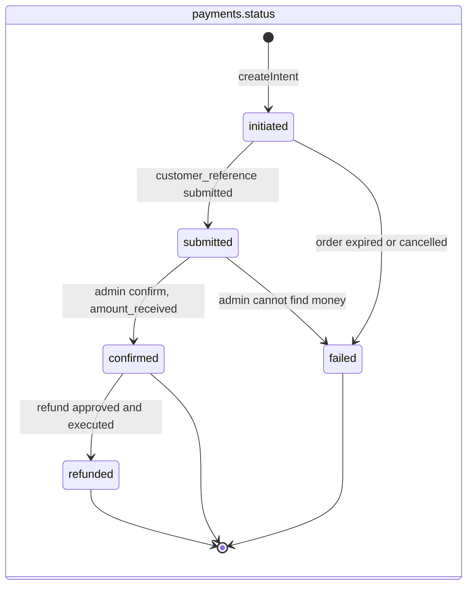
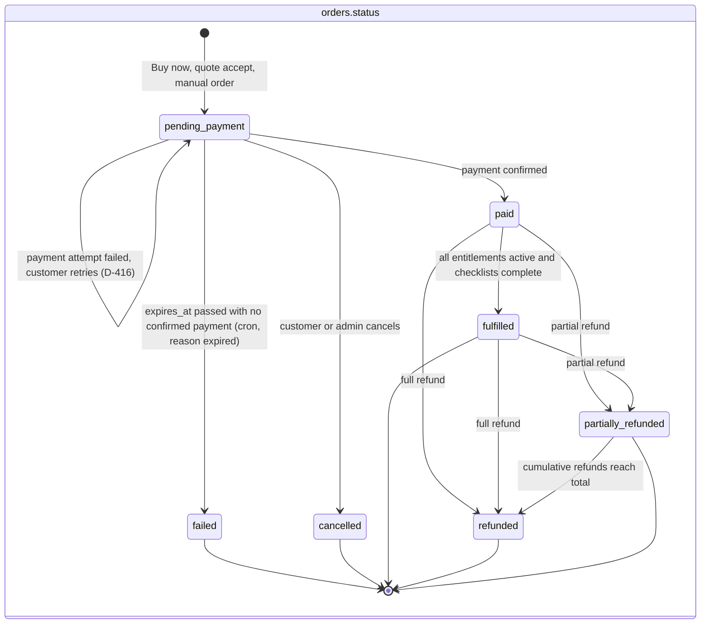
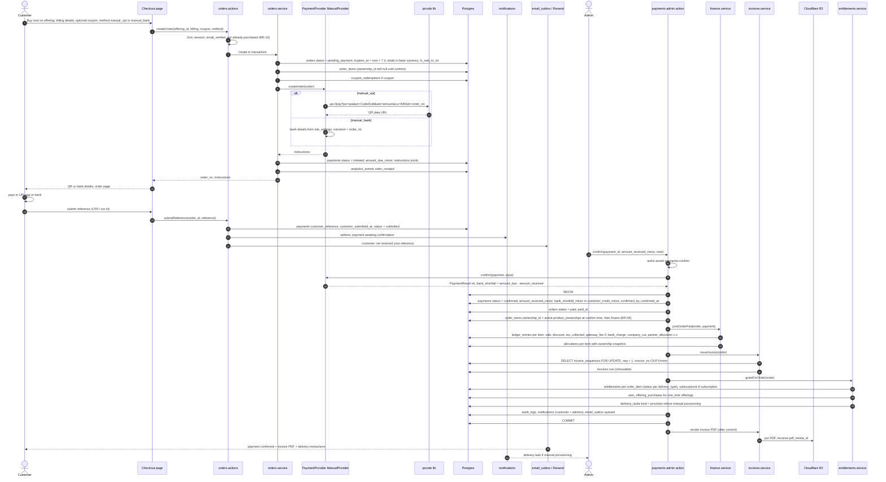
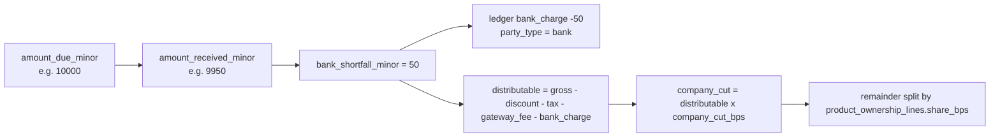
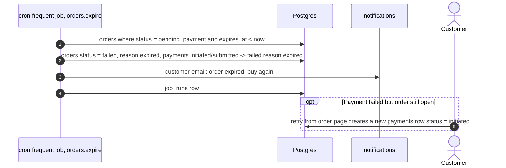
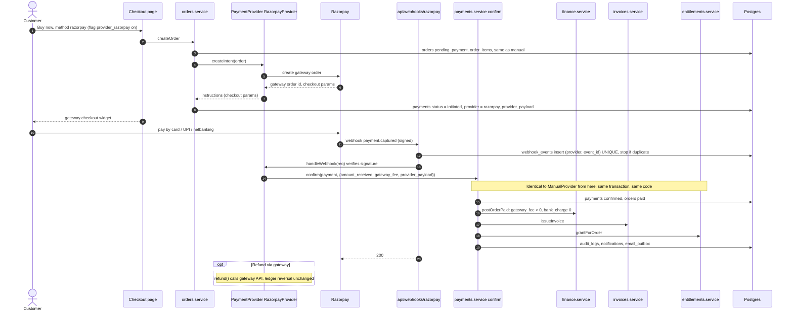
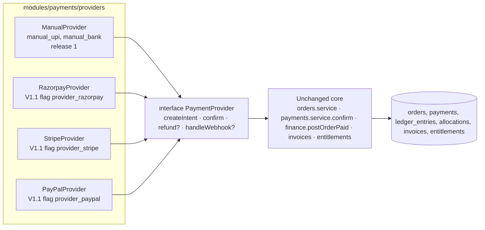

# Payment Flow

**Implements:** `docs/04` §4 (QR/UPI), §7.1 PaymentProvider, §7.2 ledger posting · `docs/05` T-orders, T-payments, T-invoices, T-entitlements, T-ledger_entries · baseline §6, §7
**Decision IDs:** ADR-04, A-402, D-402, D-501, D-411, D-412, D-414, D-416, D-516, D-515, BR-06, BR-10, BR-16, BR-17, MASTER_SPEC §4.1, §4.4, §4.8

---

## 1. Status machines

**Legend:** `payments` rows are frozen once `confirmed`; the trigger allows exactly one later change, `confirmed → refunded` plus `amount_refunded_minor` (MASTER_SPEC §7, `docs/05` §12). An overpayment is stored as `payments.customer_credit_minor` and shown to admins, never allocated (MASTER_SPEC §7). A refund is a new `refunds` row plus reversal ledger entries. A new `payments` row is created for each retry while the order stays `pending_payment`; `failed` is terminal and is reached only when `expires_at` passes with no confirmed payment — including after an admin marked the reference invalid and no retry followed (MASTER_SPEC §7 "Order failed", `docs/03` FR-COM-06); `cancelled` is only a customer/admin cancel (BR-10).

---

## 2. ManualProvider path in detail (release 1)

**Legend:** everything between BEGIN and COMMIT is atomic; if the ledger or invoice write fails the confirmation rolls back and the payment stays `submitted`. PDF rendering happens after commit and is retried by cron if R2 fails (`docs/04` §10). Order and ledger code only see `PaymentProvider` and `PaymentResult`, never UPI specifics (ADR-04).

---

## 3. Shortfall handling (D-516, BR-06)

---

## 4. Expiry and retry (BR-10, D-416)

---

## 5. Future gateway path (V1.1, D-501): only the provider changes

**Legend:** the only provider-specific columns are `payments.provider` and `payments.provider_payload`, plus the `webhook_events` idempotency table; `gateway_fee` becomes non-zero and `bank_charge` zero. Order status, ledger posting, invoice issuing and entitlement creation are the same functions (MASTER_SPEC §4.4). Gateway refund wording remains an open legal item (R-502).
