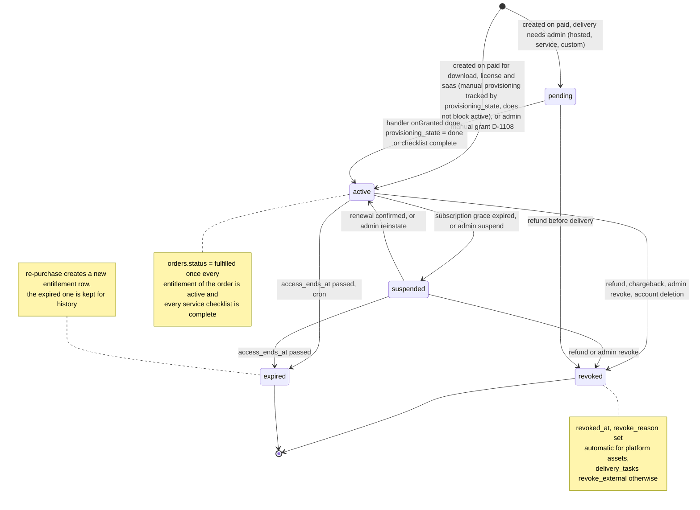
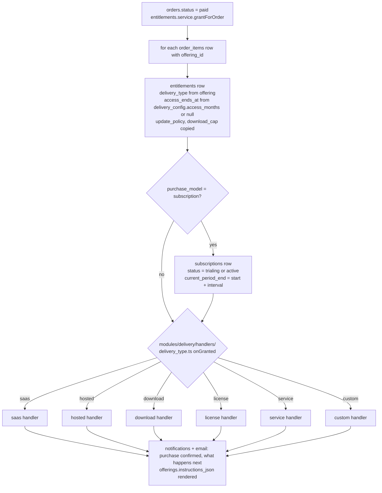
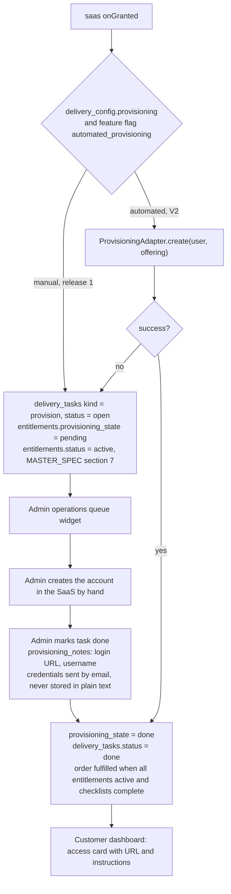
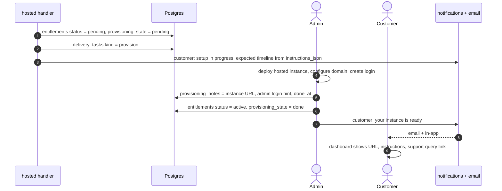
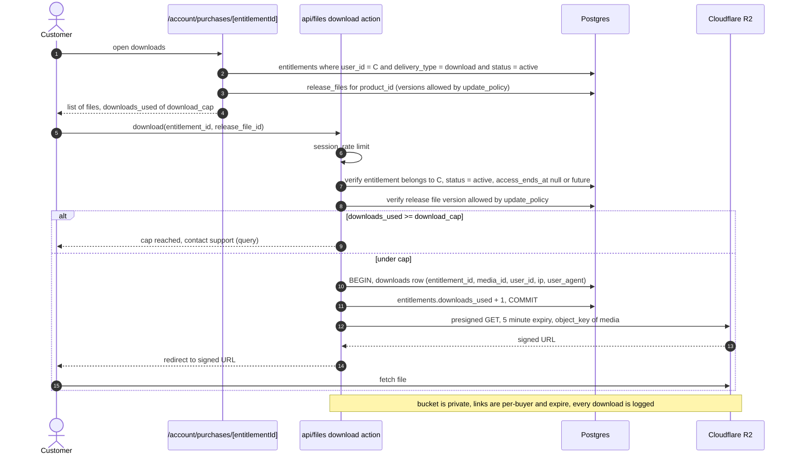
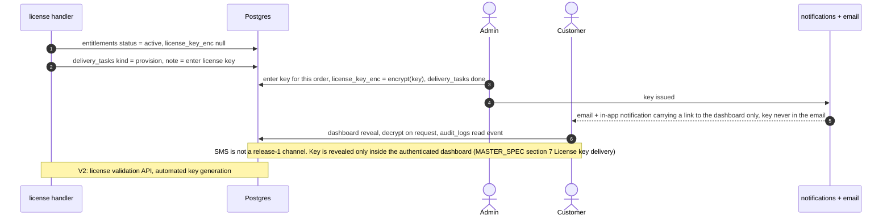
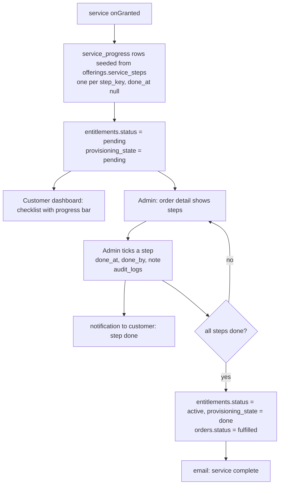
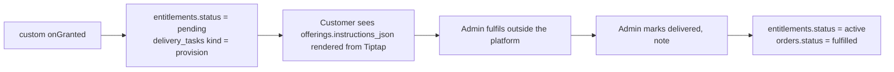
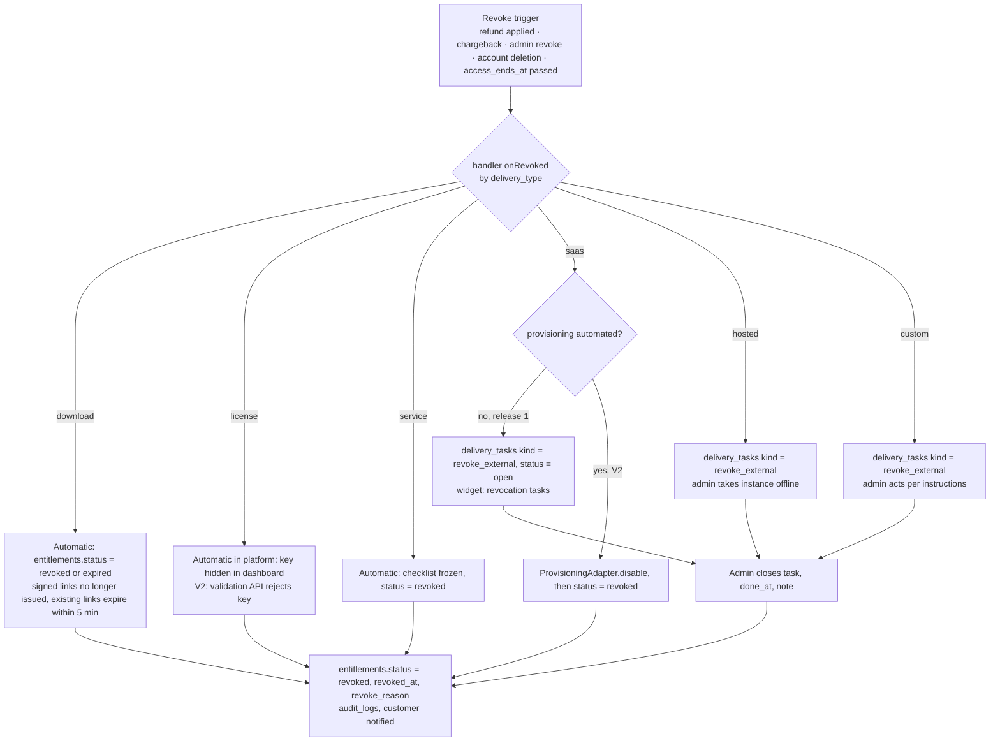
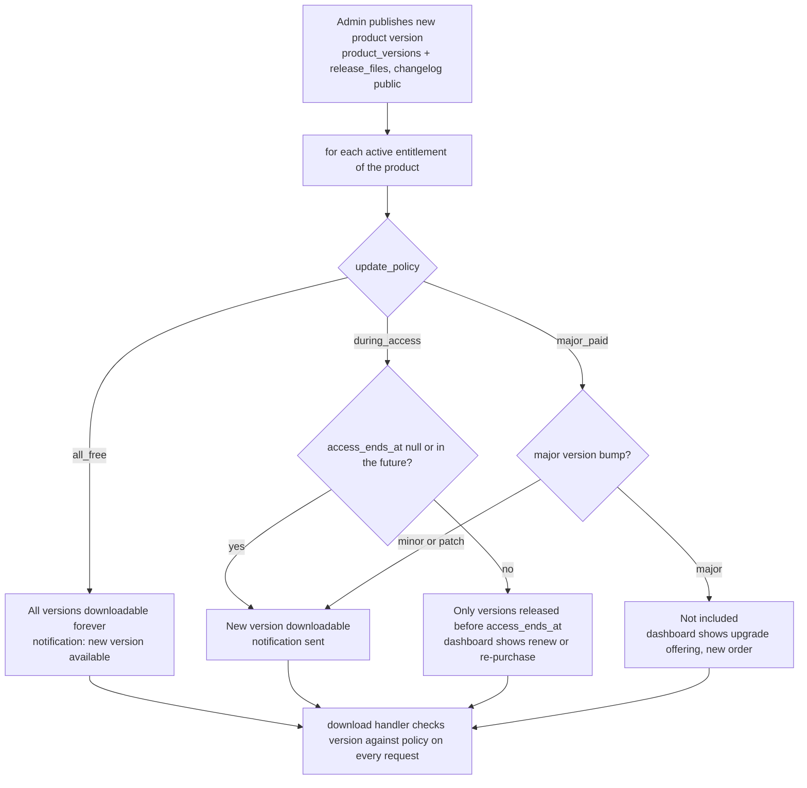

# Product Delivery Flow

**Implements:** baseline §8 delivery model, BR-15 · `docs/04` §6 files, §7.3 entitlements and delivery, §7.9 flags · `docs/05` T-entitlements, T-subscriptions, T-service_progress, T-downloads, T-delivery_tasks, T-release_files · MASTER_SPEC §4.3, §7 (license key channel, manual grants)
**Decision IDs:** A-601, A-602, D-406, D-601, D-602, D-603, D-604, D-605, D-606, D-607, D-608, D-1108, D-1602 (flag automated_provisioning)

---

## 1. Entitlement state machine (`entitlements.status`)

---

## 2. Handler dispatch by `delivery_type` (`docs/04` §7.3)

**Legend:** each handler implements `onGranted`, `onRevoked`, `render(customerView)`, `adminActions`. The entitlement never knows the provider or the storage; the handler does.

---

## 3. SaaS delivery: manual now, automated behind flag (D-601, flag `automated_provisioning`)

---

## 4. Hosted delivery (D-601, A-601)

---

## 5. Download delivery with signed URL and cap (D-602, D-606, BR-15)

---

## 6. License key delivery and reveal (D-603, D-406, MASTER_SPEC §7)

---

## 7. Service checklist delivery (D-608)

---

## 8. Custom delivery (A-601)

---

## 9. Revocation: automatic vs delivery task (D-607, D-605)

**Legend:** platform-held assets revoke instantly; external accounts create an open `delivery_tasks` row so nothing is silently forgotten (D-607). Status is written `revoked` for refund/chargeback/admin, `expired` for the end of a fixed access period (D-604).

---

## 10. Update policy branches (`entitlements.update_policy`, D-604, D-605)

**Legend:** the policy is copied from `offerings.delivery_config.update_policy` onto the entitlement at grant time so later offering edits do not change what an existing buyer already has. The same check gates SaaS and hosted feature updates in V2; in release 1 it only affects downloadable versions.
