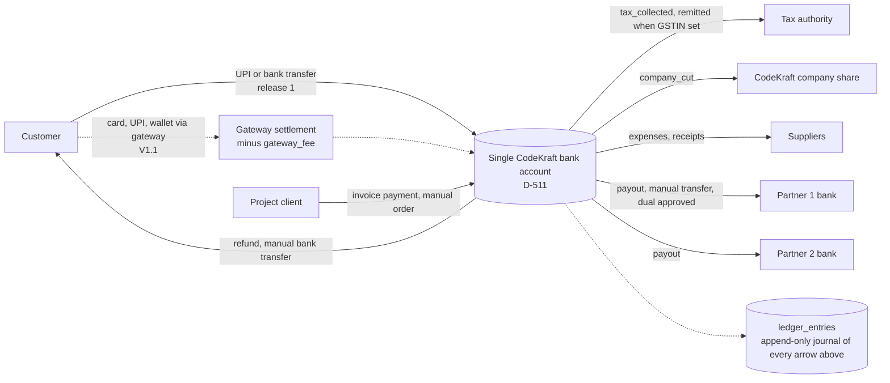
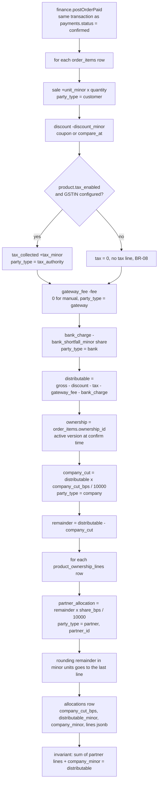
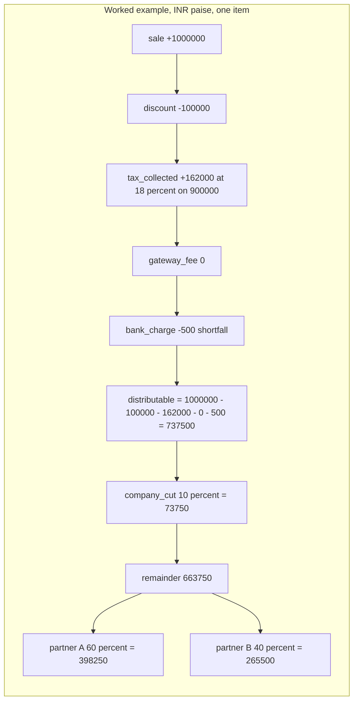
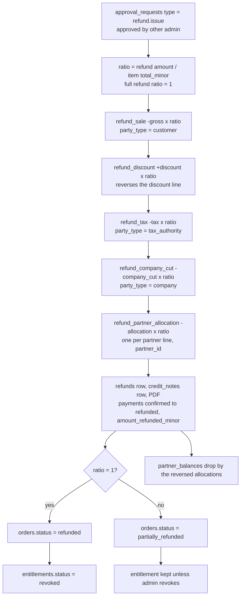
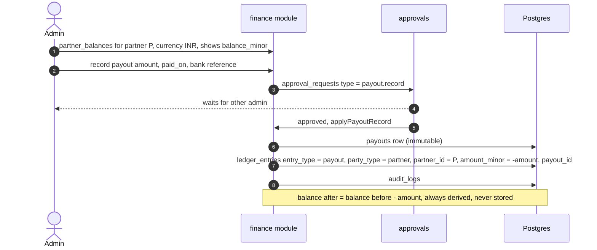
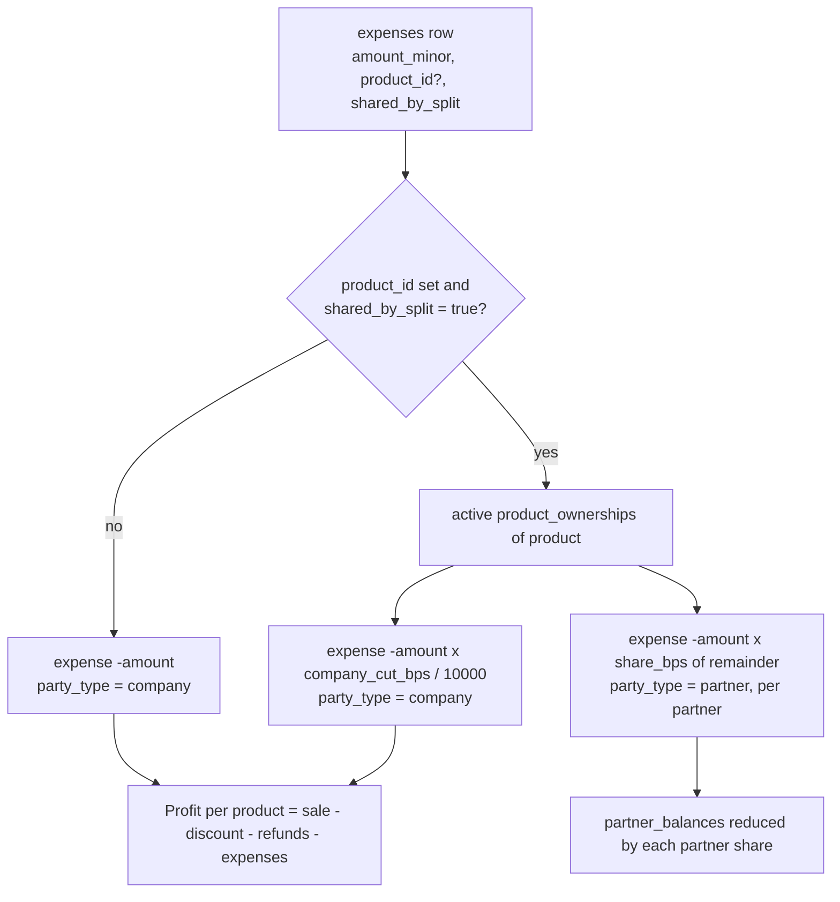
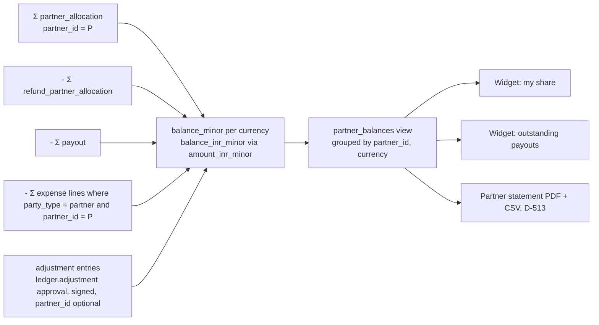
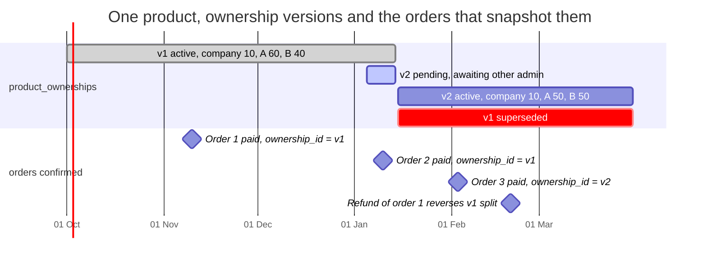
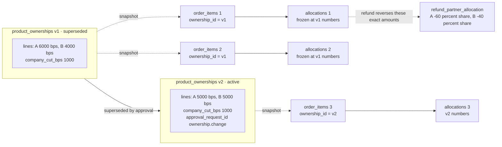

# Revenue Flow and Finance Ledger

**Implements:** baseline §7 revenue model, BR-05, BR-06, BR-07, BR-08, BR-17 · `docs/04` §7.2 · `docs/05` §4 ownership, §7 ledger · MASTER_SPEC §4.1, §4.8, §7 (tax before GST)
**Decision IDs:** D-506, D-507, D-508, D-509, D-511, D-513, D-514, D-515, D-516, D-517, D-1105, D-1501, A-502, ADR-05

All amounts are integer minor units in the transaction currency plus an INR equivalent at the payment-date `fx_rate_to_inr` (D-515). Entry types are the `ledger_entries.entry_type` enum values.

---

## 1. Money flow: customer → CodeKraft account → partners

**Legend:** money physically moves only through the single company account; the ledger is the record, never the mover (automated payouts are V2). Buyers never see partners (BR-02).

---

## 2. Ledger posting per order item on payment confirmation (BR-06, D-507, D-516)

**Legend:** BR-06 formula exactly: distributable = gross − discount − tax − gateway charges − bank shortfall; company cut first (may be 0), remainder by percentages totalling 100%. The `bank_charge` for a multi-item order is apportioned across items by total_minor. Amounts are signed from the company's point of view in `ledger_entries.amount_minor`.

---

## 3. Refund reversal (BR-09, D-414, `docs/04` §7.2)

**Legend:** original entries are never touched (BR-17); every reversal is a new entry linked by `refund_id`: sale, discount, tax, company cut and partner allocations proportionally (`refund_sale`, `refund_discount`, `refund_tax`, `refund_company_cut`, `refund_partner_allocation`). `bank_charge` and `gateway_fee` are never reversed because the bank and gateway keep them (MASTER_SPEC §7 "Refund reversal scope").

---

## 4. Payout (D-511, D-1105)

---

## 5. Expense (D-514)

---

## 6. Partner balance computation (VIEW partner_balances)

**Legend:** balances are sums over `ledger_entries` only (ADR-05). An Admin-role user sees only rows where `partner_id` is their own partner (D-512); Super Admins see all.

---

## 7. Ownership versioning timeline: immutability of past allocations (BR-05, D-509)

**Legend:** a split change is a new `product_ownerships` version that becomes `active` only when the `ownership.change` request is approved by the other admin; it applies to payments confirmed after `effective_from`. Orders confirmed under v1 keep `order_items.ownership_id = v1` and their `allocations` rows forever, and a later refund reverses the v1 numbers, not v2 (BR-05, BR-17).
