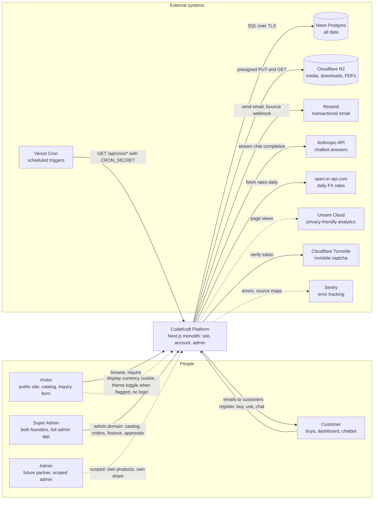
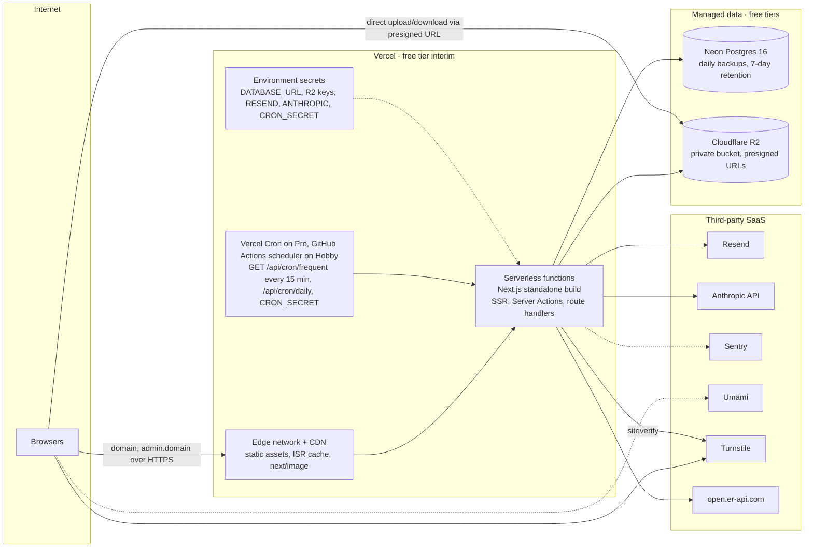
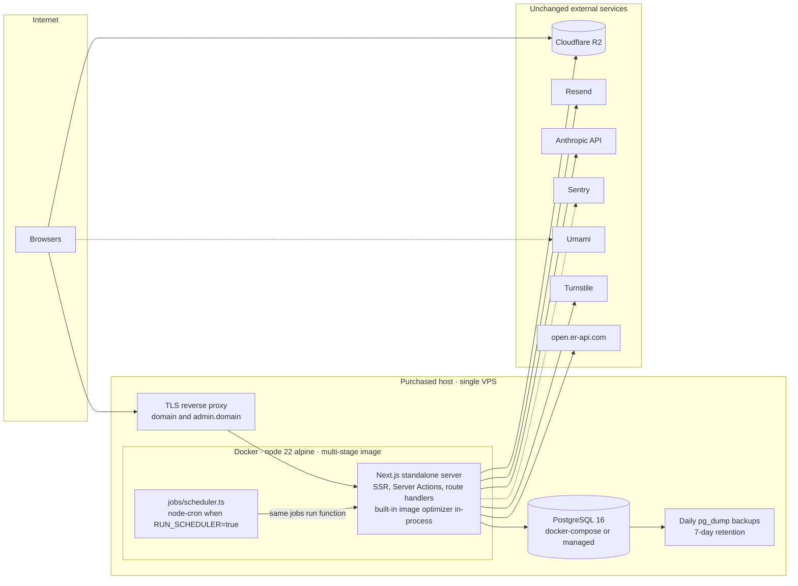
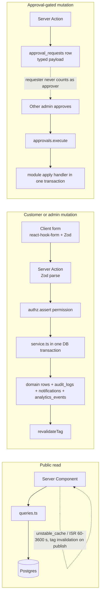

# System Architecture Diagrams

**Implements:** `docs/04-SOLUTION-ARCHITECTURE.md` §3–§6, §8, §10, §11 · `MASTER_SPEC.md` §4 · baseline §3, §12, §13
**Decision IDs:** ADR-01, ADR-02, ADR-03, ADR-06, ADR-08, ADR-09, A-1201, A-1301, A-1401, A-1501, D-1401, D-1402, D-1403, D-1606, D-015, D-707, D-501, A-402

C4 diagrams are drawn as Mermaid flowcharts with subgraphs (portable across every Mermaid renderer). Level 1 = context, Level 2 = containers, then deployment views.

---

## 1. Context diagram (C4 level 1)

**Legend:** solid arrow = synchronous request; dotted arrow = fire-and-forget or optional; cylinder = data store. Failure behaviour per `docs/04` §10: Neon down = app unavailable; Anthropic down = menu-only chatbot; Resend down = `email_outbox` retry; Turnstile fail-closed on public forms.

---

## 2. Container diagram (C4 level 2)

```mermaid
flowchart TB
    subgraph Clients ["Browsers"]
        SiteUA["Public site<br/>domain"]
        AcctUA["Customer dashboard<br/>domain/account"]
        AdminUA["Admin app<br/>admin.domain"]
    end

    subgraph App ["Next.js 15 app · one deployable · output standalone"]
        direction TB
        MW["middleware.ts<br/>host equals ADMIN_HOST exactly: rewrite to /admin/*<br/>404 /admin on main host"]

        subgraph Routes ["app/ route groups"]
            direction LR
            RSite["(site)<br/>SSR/SSG public pages<br/>/ /services /products /projects /blog /contact /legal"]
            RAuth["(auth)<br/>/auth/login /auth/register /auth/verify /auth/reset /auth/otp"]
            RAccount["(account)<br/>/account/* /checkout/[offeringId] /quote/[token]"]
            RAdmin["(admin)<br/>/admin/* role required"]
        end

        subgraph API ["app/api route handlers"]
            direction LR
            ApiAuth["auth/[...all]<br/>Better Auth"]
            ApiCron["cron/frequent, cron/daily<br/>secret header, two consolidated jobs"]
            ApiWebhooks["webhooks/*<br/>payment providers V1.1, Resend"]
            ApiChat["chat<br/>SSE streaming"]
            ApiFiles["files/*<br/>signed upload/download"]
            ApiNotif["notifications<br/>GET ?since= poll"]
            ApiOg["og/*<br/>OG images"]
        end

        subgraph Modules ["modules/ · domain boundary · service.ts only cross-imports"]
            direction LR
            MAuth["auth · authz · users"]
            MCatalog["catalog · offerings · media · content · blog"]
            MCommerce["orders · payments · coupons · quotes · invoices"]
            MDelivery["entitlements · delivery · subscriptions"]
            MFinance["finance: ledger, allocations, payouts, expenses, reports"]
            MGov["approvals · audit · settings"]
            MEngage["leads · queries · chat · notifications"]
            MMisc["dashboard-widgets · analytics · fx · search · seo"]
        end

        subgraph Support ["Supporting code"]
            direction LR
            Jobs["jobs/<br/>order expiry, sub reminders, grace, scheduled publish, retention purge, FX refresh, knowledge re-index"]
            PDF["pdf/<br/>invoice, credit note, partner statement<br/>react-pdf server"]
            Emails["emails/<br/>react-email templates"]
            Drizzle["drizzle/<br/>schema, SQL migrations, custom triggers"]
            Tokens["styles/tokens.css<br/>data-theme dark-cinematic, light-editorial"]
        end
    end

    subgraph Ext ["External services"]
        direction LR
        Neon[("Neon Postgres 16")]
        R2[("Cloudflare R2")]
        Resend["Resend"]
        Anthropic["Anthropic API"]
        ERAPI["open.er-api.com"]
        Turnstile["Turnstile"]
        Sentry["Sentry"]
        Umami["Umami"]
        VCron["Vercel Cron"]
    end

    SiteUA --> MW
    AcctUA --> MW
    AdminUA --> MW
    MW --> RSite
    MW --> RAuth
    MW --> RAccount
    MW --> RAdmin
    RSite -->|"Server Components, queries.ts"| Modules
    RAccount -->|"Server Actions"| Modules
    RAdmin -->|"Server Actions + authz.assert + audit"| Modules
    API --> Modules
    ApiCron --> Jobs
    Jobs --> Modules
    Modules --> Drizzle
    Drizzle --> Neon
    MCommerce --> PDF
    MFinance --> PDF
    PDF -->|"store PDF"| R2
    MEngage --> Emails
    Emails --> Resend
    MCatalog -->|"presigned URLs"| R2
    MDelivery -->|"5-min signed GET"| R2
    ApiFiles --> R2
    ApiChat -->|"LLMProvider.stream"| Anthropic
    MMisc -->|"fx_rates"| ERAPI
    RSite -->|"public forms"| Turnstile
    ApiWebhooks -. "V1.1 gateways" .-> MCommerce
    VCron --> ApiCron
    App -.-> Sentry
    RSite -.-> Umami
    AdminUA -->|"poll GET /api/notifications every 10 s"| ApiNotif
    AcctUA -->|"poll every 30 s"| ApiNotif
```

**Legend:** one Next.js deployable serves three audiences; the admin subdomain is a middleware host rewrite (ADR-09, A-1201), giving isolated host-only cookies. Modules are the unit of parallel agent work (`docs/04` §5). Admin "real-time" is polling (ADR-06). Payment providers sit behind `PaymentProvider`; release 1 ships `ManualProvider` only (ADR-04, A-402); gateway webhooks are dotted because they arrive in V1.1.

---

## 3. Deployment — release 1 on Vercel (D-1401, R-1401 interim)

---

## 4. Deployment — V1.1 on purchased hosting (Docker/VPS, D-1606, `docs/04` §11)

**Legend:** what changes between §3 and §4 is only the runtime host and the cron trigger (Vercel Cron / GitHub Actions scheduler → node-cron; the two consolidated jobs `frequent` and `daily` are the same functions, MASTER_SPEC §7 "Cron on free tier"). No Vercel-only API is used inside `modules/`; `next/og` replaces `@vercel/og`; the same `output: 'standalone'` build runs in both (D-1401). Postgres can be Neon or any Postgres because Drizzle migrations are plain SQL (ADR-02).

---

## 5. Cross-cutting request patterns (`docs/04` §6)

**Legend:** every admin mutation writes an `audit_logs` row in the same transaction (MASTER_SPEC §4.9, D-1104). Approval-gated actions are one generic mechanism (A-1101, BR-13).
