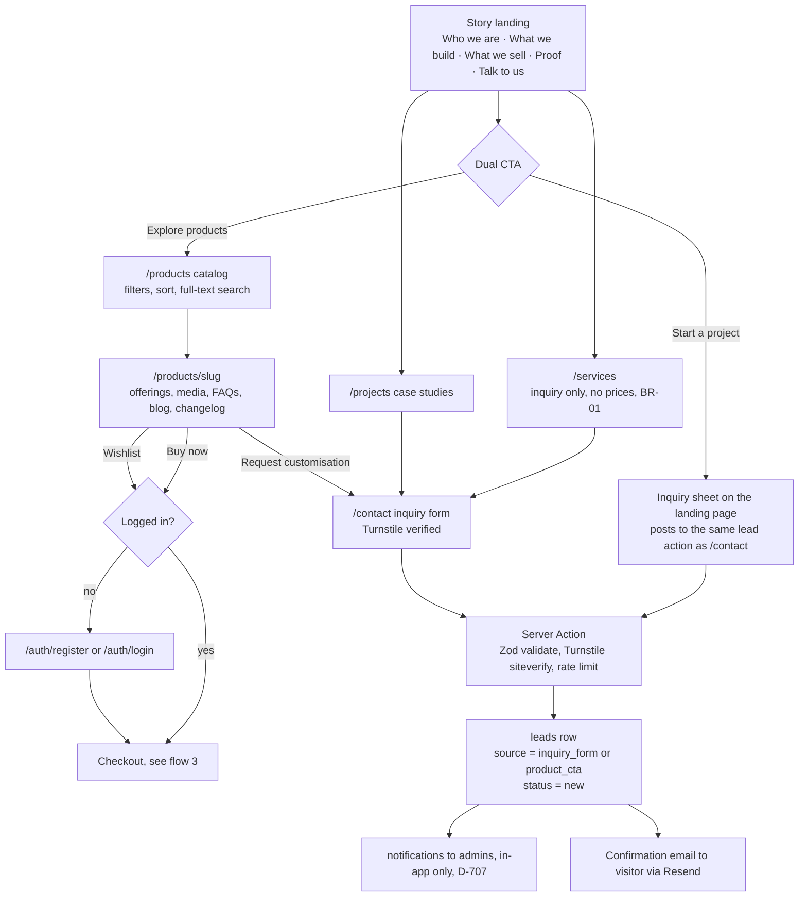
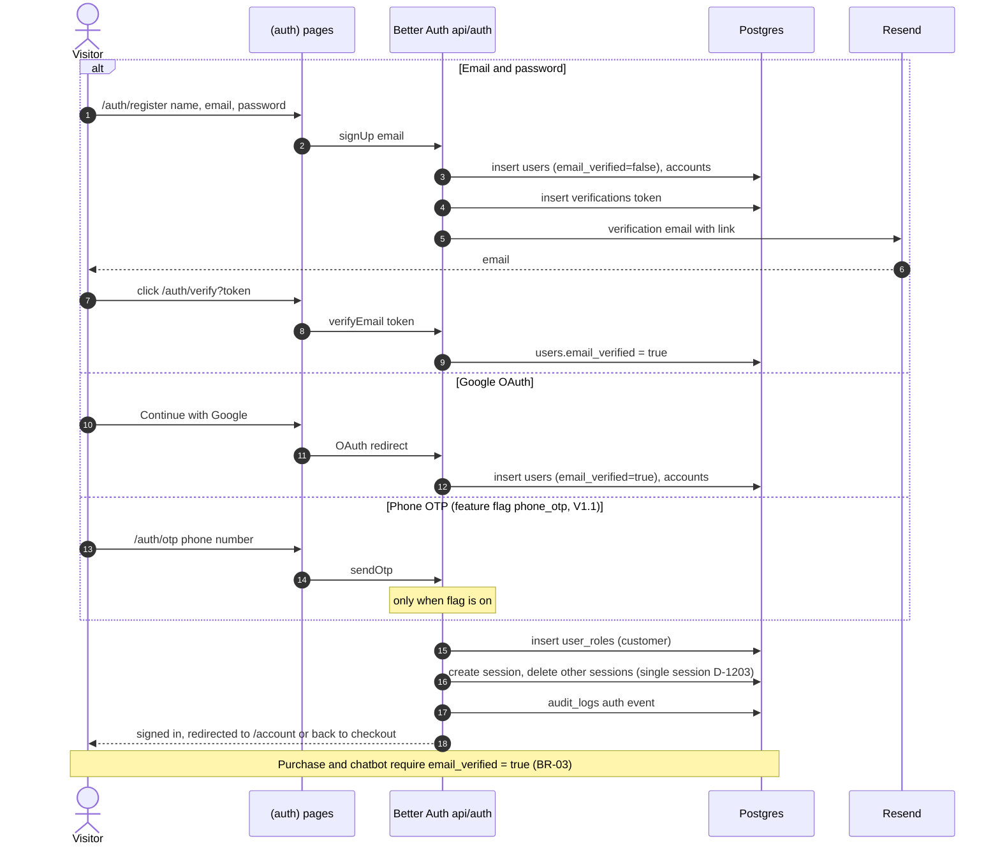
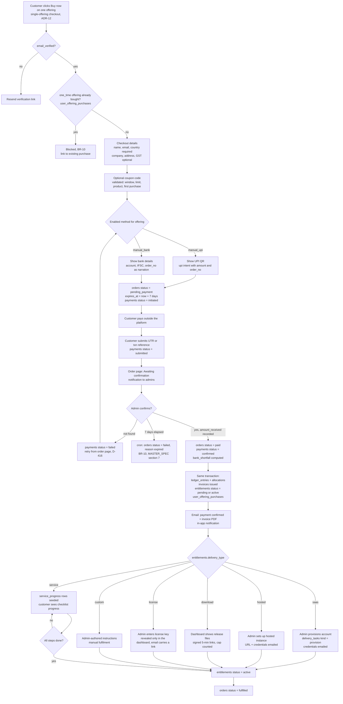
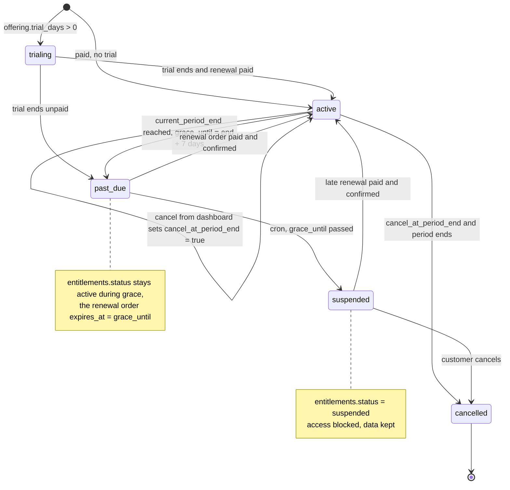
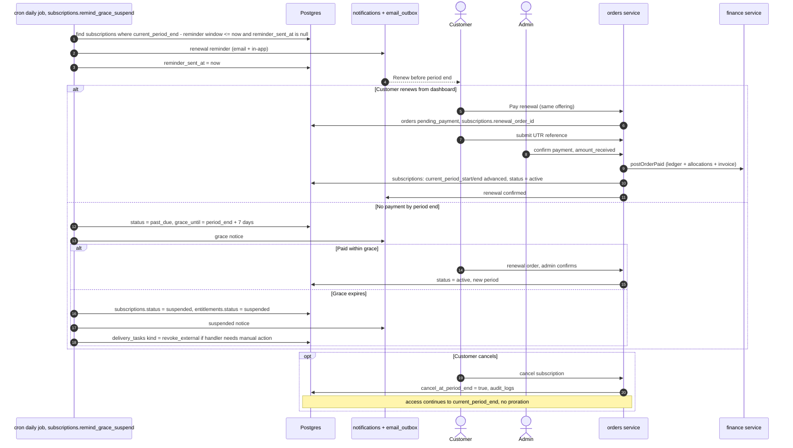
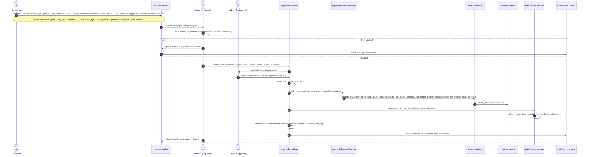
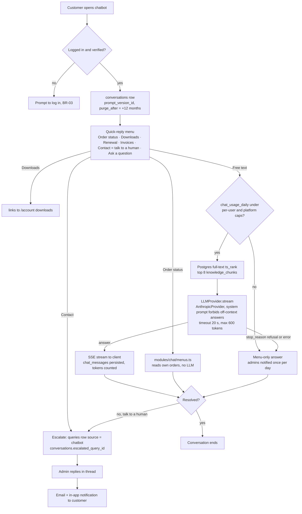
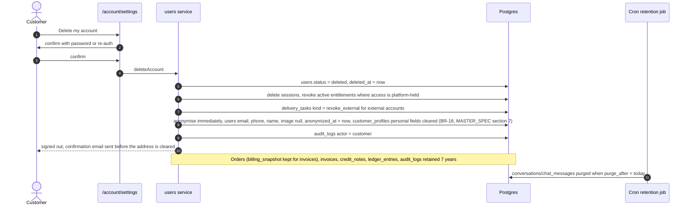

# User Flows (Visitor and Customer)

**Implements:** baseline §9 user journeys, §6 commerce model, §8 delivery model, §11 chatbot · `docs/04` §6, §7.1, §7.3, §9 · `docs/05` T-orders, T-payments, T-entitlements, T-subscriptions, T-queries, T-conversations
**Decision IDs:** D-801, D-802, D-315, D-808, D-1201, D-204, D-205, D-501, D-411, D-412, D-413, D-516, D-521, D-505, D-414, D-415, D-701, D-702, D-708, D-1003, BR-03, BR-09, BR-10, BR-14, BR-15, BR-18, A-501, A-602

Status values are the Postgres enum values from `docs/05`.

---

## 1. Discover → inquire (D-801, D-802, D-315, D-808)

**Legend:** visitors never need an account to inquire (BR-03); the inquiry form is the only visitor write. Product page "Request customisation" carries `product_id` into the lead (D-315).

---

## 2. Register and verify (D-1201, D-1603, BR-03)

---

## 3. Buy now → checkout → manual payment → confirmation → delivery (D-501, D-411, D-516, A-602)

**Legend:** everything from `Paid` to `Post` happens in one DB transaction (`docs/04` §7.1). Download, license and saas entitlements become `active` on paid (saas manual provisioning is tracked by `provisioning_state = pending` and does not block `active`); hosted, custom and service entitlements start `pending` until the admin completes delivery (D-601, D-608). The order is `fulfilled` when every entitlement is `active` and every service checklist is complete (MASTER_SPEC §7 "Order fulfilled"). Full payment detail is in `payment-flow.md`.

---

## 4. Subscription renewal, grace and suspension (BR-14, D-521, A-501)

---

## 5. Refund request → admin → credit note → revoke (BR-09, D-505, D-414, D-415)

---

## 6. Chatbot: menus, AI, caps, escalation (D-701, D-702, D-708, BR-03)

**Legend:** menu intents never call the LLM. Caps are checked before every AI call and the count is written per user and per platform (D-708). Transcripts are purged by cron after `purge_after` (D-1503).

---

## 7. Account deletion with retention (BR-18, D-1003, D-1503)

**Legend:** anonymisation, not deletion, so finance and audit records stay valid (BR-18). Anonymisation is immediate on self-delete — there is no grace window (MASTER_SPEC §7 "Anonymisation timing", `docs/05` §12).
